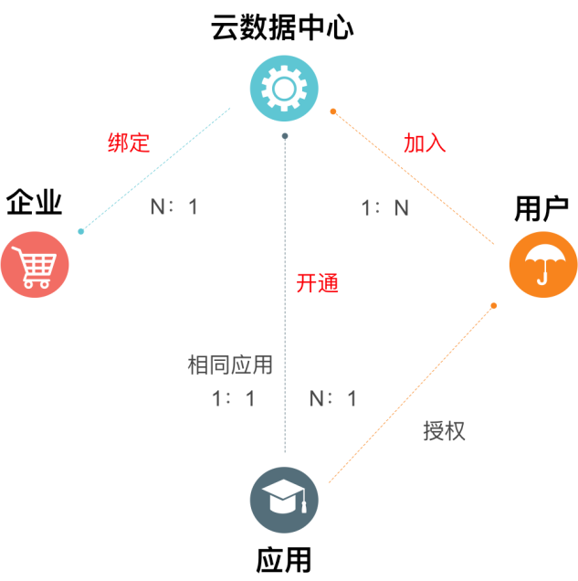

# 友互通模型

*	企业  
    用友云基础数据，认证过的企业具有经过国家工商部门审核的牌证。  
*	云数据中心  
    基础的业务控制数据信息，是数据隔离、业务隔离、流程隔离、资源隔离、计费隔离等的依据。  
*	用户  
    用友云基础数据，是云产品、软件产品的具体使用人员的账户。一个用户一个ID，终身唯一，是进入、通行用友云的“身份证”。  
*	应用  
    用友云中可注册、开通的所有产品，既包含财务云、人力云等云服务产品，也包含U8、U8 Cloud。
