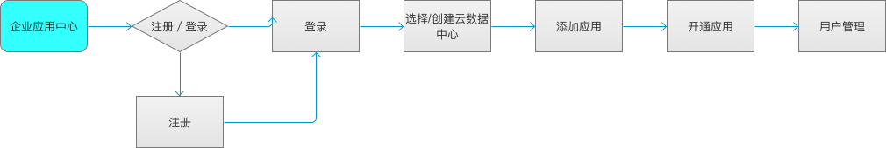

# 典型场景

友户通对以下各类产品提供不同的服务支持。  
1、	软件产品  
    如：U8、U8 Cloud、NC、U9等软件产品。友户通提供云注册解决方案，即用户需首先在友户通进行注册和授权，然后才能在软件端使用。

2、	SaaS业务  
    如：财务云、人力云、协同云、采购云、营销云等。友户通提供统一应用开通、统一用户鉴权。

3、	互联网化业务  
    如：薪福社、友文化、电子发票、嘟嘟等。友户通提供统一用户、统一鉴权。

4、	其他  
    如：云市场、云商务、用友云app等。友户通提供统一用户、统一鉴权。

一、应用开通、用户鉴权  

客户购买软件产品和SaaS业务，均需要在企业应用中心进行应用开通。开通应用前，需先新建或选择一个云数据中心。云数据中心能更方便、安全的管理用户和隔离应用数据。均需要在应用中心进行应用开通，流程如下：

 用友云的新客户下单后，首先就是为其创建云数据中心。每一个云数据中心是一个独立的服务计量、计费空间，也是云服务产品运行的基础环境。  
 
用户统一在应用中心创建，可以批量导入或者新建；用户授权的过程是把用户加入云数据中心并分配已开通的应用使用权限。   

SaaS类应用会直接使用用户中心数据，云注册接入的产品会依据分配关系把用户中心数据下载到本地系统再使用。

二、云数据中心绑定企业  

对于某些特定应用（U8、电子发票等），要求应用在激活前，应用所在的云数据中心必须经过认证（即绑定了某个认证企业）。一个云数据中心仅可绑定一个认证企业。一个企业可以被多个云数据中心绑定。

